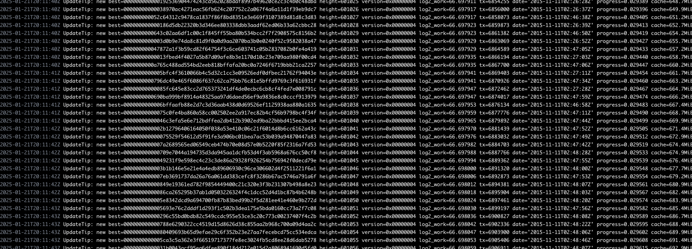
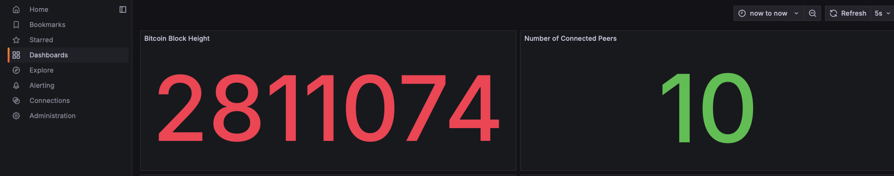
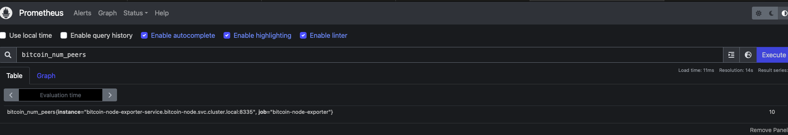

# One-Click Bitcoin Node Deployment

A project to deploy and monitor a Bitcoin node on Kubernetes with automated setup and observability.

## Briefs
- [Setup](#setup)
  - [Minikube Installation](#minikube-installation)
  - [Bitcoin Node Deployment](#bitcoin-node-deployment)
  - [Bitcoin Node Exporter Service](#bitcoin-node-exporter)
  - [Deploying Monitoring Stack](#monitoring-stack)
- [Next Steps (Prod)](#production-considerations)
- [References](#references)

##  Setup Minikube
There are two ways to setup minikube:

#### Option 1: Using Ansible to setup minikube on ubuntu/macos
```bash
ansible-playbook -i ansible/inventories/inventory.yml ansible/playbook.yml
```

#### Option 2: Using Minikube CLI to setup minikube on ubuntu/macos
```bash
make setup-minikube-macos
make start-minikube
```

> P.S: Since its a local kubernetes cluster, I didnt want to use any elaborate tools like terraform to automate the setup so I just decided to use something basic, however my approach will be different for a production usecase.

## 2. Deploying Bitcoin Node
I kustomize to deploy the bitcoin node, you can find the kustomize files in the k8s/bitcoin-node directory.

> The idea around this is for easy multi-environment deployment and to also avoid too many replicared k8s manifest files.

#### Steps to Deploy
1. set environemnt variable to testnet or mainnet

```bash
export NAMESPACE=bitcoin-node
export ENVIRONMENT=testnet  
```
2. Create namespace and deploy:

```bash
kubectl create namespace ${NAMESPACE}
make deploy
```

#### Bitcoin Node Exporter
- to build locally on any architecture, you can use the following:

```bash
make build-bitcoin-node-exporter
```

to run and test locally
:
```bash
./cmd/bitcoin-exporter/bitcoin-exporter
```
- to build with docker
```bash
make build
```

- to deploy to local kubernetes cluster, ensure you have a namespace 

```bash
kubectl create namespace ${NAMESPACE}
make deploy
```

#### Setup Monitoring
Deploy Proemtheus

```bash
cd monitoring/prometheus && make deploy
```
Deploy Grafana

```bash
cd monitoring/grafana && make deploy
```

Deploy Promtail

```bash
cd monitoring/promtail && make deploy
```

Deploy Loki

```bash
cd monitoring/loki && make deploy
```

### Production ToDO
- Automate the deployment of K8s Cluster and its resources (nginx, secret manager etc) with Kubernetes
- Better Secret management with Hashicorp vault or Cloud KMS alongside integration with kubernetes secret operator
- Add more imprtant metrics to the bitcoin node exporter
- Use Grafana Cloud instead of Grafana OSS for Dashbaords and Alert Managemet
- Portect and Gate proemtheus, grafama, loki, promtail with nginx ingress controller anf cloudflared


#### Screenshot to show DoD





# References
- https://github.com/bitcoin/bitcoin/blob/master/doc/bitcoin-conf.md
- https://github.com/btcsuite/btcd/rpcclient
- https://prometheus.io/docs/guides/go-application/
- https://developer.bitcoin.org/reference/rpc/
- https://pkg.go.dev/github.com/btcsuite/btcd/rpcclient
- https://prometheus.io/docs/instrumenting/writing_exporters/
